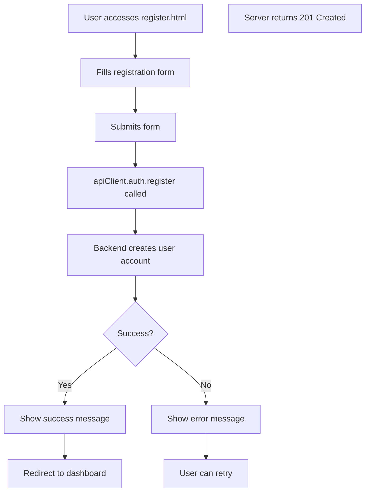
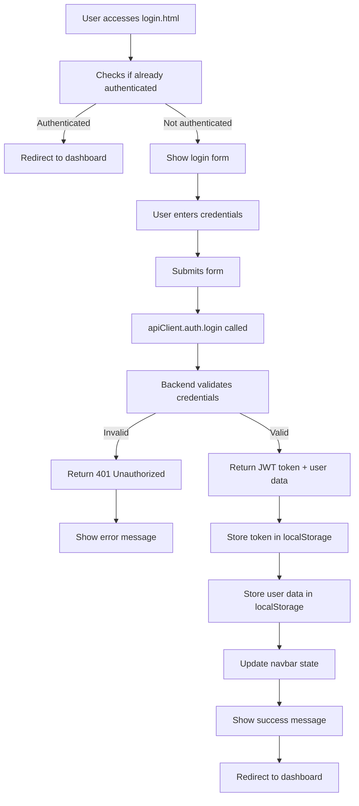
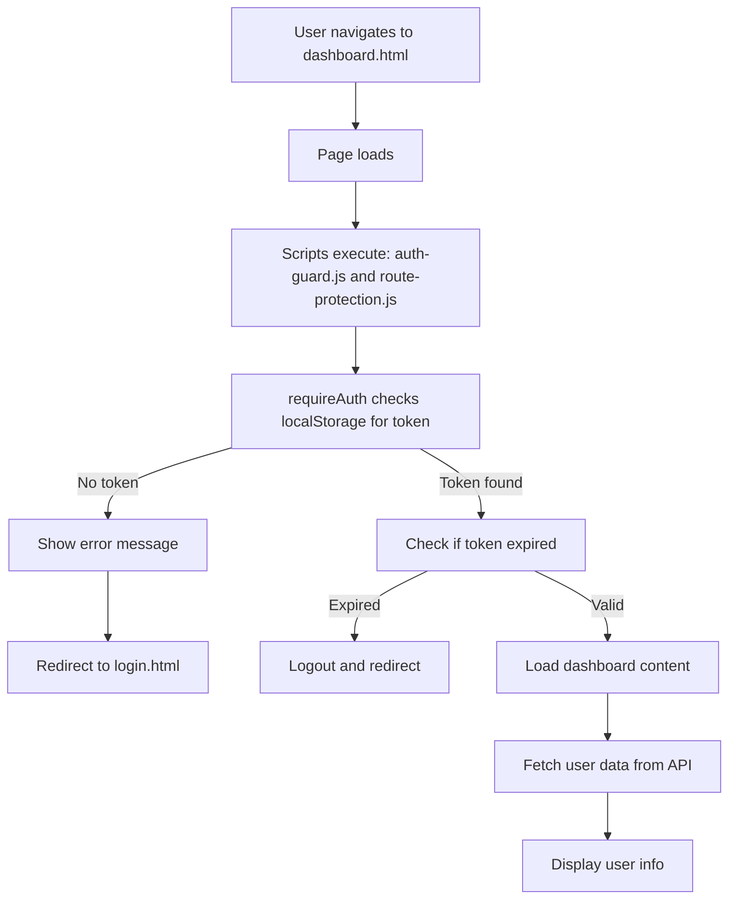
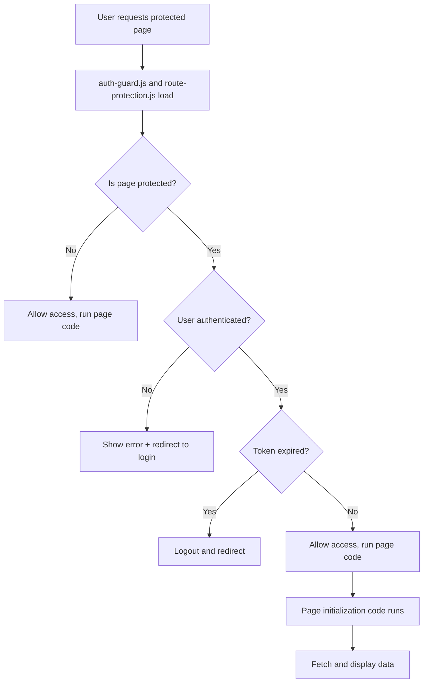

# Complete Authentication System Documentation

## Overview

The UAlbany Campus Portal implements a comprehensive frontend authentication system that:

- Protects routes from unauthorized access
- Manages user sessions via JWT tokens stored in localStorage
- Updates UI based on authentication state
- Displays user information across pages
- Handles logout and session management

---

## Architecture & Components

### 1. **API Client** (`frontend/js/api-client.js`)

Centralized wrapper for all backend API calls with automatic JWT token injection.

**Key Features:**

- Automatic token injection in Authorization headers
- Organized methods by resource (auth, profiles, posts, etc.)
- Error handling with user-friendly messages
- Global instance: `window.apiClient`

**Authentication Methods:**

```javascript
// Register new user
await apiClient.auth.register({
  name: 'John Doe',
  email: 'john@example.com',
  password: 'password123',
});

// Login user
const response = await apiClient.auth.login({
  email: 'john@example.com',
  password: 'password123',
});
// Response contains: { token, user }

// Get current authenticated user
const user = await apiClient.auth.getCurrentUser();

// Logout (just clear local storage, no API call needed)
// Handled by auth-guard.js logout() function
```

### 2. **Authentication Guard** (`frontend/js/auth-guard.js`)

Low-level authentication utilities for checking auth state and route protection.

**Key Functions:**

| Function                | Purpose                                     | Example                                   |
| ----------------------- | ------------------------------------------- | ----------------------------------------- |
| `isAuthenticated()`     | Check if user has valid token               | `if (isAuthenticated()) { ... }`          |
| `getCurrentUser()`      | Get user object from localStorage           | `const user = getCurrentUser();`          |
| `requireAuth(callback)` | Protect page, redirect to login if not auth | `requireAuth(() => { loadDashboard(); })` |
| `getToken()`            | Get JWT token string                        | `const token = getToken();`               |
| `isTokenExpired()`      | Check if JWT token is expired               | `if (isTokenExpired()) { logout(); }`     |
| `logout()`              | Clear auth data and redirect to login       | `logout();`                               |
| `showLoadingState()`    | Show loading spinner overlay                | `showLoadingState();`                     |
| `showErrorMessage(msg)` | Show error notification                     | `showErrorMessage('Error occurred');`     |

**Basic Usage:**

```javascript
// Protect a page from unauthorized access
document.addEventListener('DOMContentLoaded', () => {
  requireAuth(async () => {
    // This code only runs if user is authenticated
    const user = await apiClient.auth.getCurrentUser();
    displayUserInfo(user);
  });
});
```

### 3. **Route Protection Middleware** (`frontend/js/route-protection.js`)

High-level page protection system that defines which pages are protected.

**Protected Routes Configuration:**

```javascript
const PROTECTED_ROUTES = {
  'dashboard.html': { requireAuth: true, requiredRole: null },
  'profile.html': { requireAuth: true, requiredRole: null },
  'create-profile.html': { requireAuth: true, requiredRole: null },
  'add-education.html': { requireAuth: true, requiredRole: null },
  'posts.html': { requireAuth: false, requiredRole: null }, // Public
  'index.html': { requireAuth: false, requiredRole: null }, // Public
};
```

**Key Functions:**

| Function                         | Purpose                             |
| -------------------------------- | ----------------------------------- |
| `applyRouteProtection(callback)` | Apply protection to current page    |
| `isCurrentPageProtected()`       | Check if current page is protected  |
| `protectedPage(initFunc)`        | Wrap initialization with protection |
| `redirectIfAuthenticated(url)`   | Send logged-in users to dashboard   |
| `getProtectedPages()`            | Get list of all protected pages     |

**Usage in Page:**

```javascript
// Dashboard page - automatically protected
document.addEventListener('DOMContentLoaded', () => {
  applyRouteProtection(async () => {
    // Load dashboard only if authenticated
    const user = await apiClient.auth.getCurrentUser();
    displayDashboard(user);
  });
});
```

### 4. **Navbar Authentication** (`js/navbar-auth.js`)

Dynamically updates navigation menu based on authentication state.

**What It Does:**

- Checks for JWT token in localStorage
- Shows/hides navbar links based on auth state
- Handles async navbar loading from module file
- Updates state immediately after page load

**Navigation States:**

**NOT AUTHENTICATED:**

```
[MyUAlbany] [Students] [Posts] [Login]
```

**AUTHENTICATED:**

```
[MyUAlbany] [Dashboard] [Students] [Posts] [Profile] [Logout]
```

### 5. **Profile Display** (`frontend/js/profile-display.js`)

Components for displaying current user information throughout the site.

**Display Functions:**

```javascript
// Show user profile card
displayUserProfileCard('container-id', {
  showEmail: true,
  showStats: true,
  showEditButton: true,
});

// Show user avatar with initials
displayUserAvatar('avatar-id', {
  size: '48px',
  showName: true,
});

// Display user dropdown menu
displayUserMenu('menu-id');
```

---

## Authentication Flow

### Registration Flow



### Login Flow



### Dashboard Protection Flow



### General Protected Page Flow



---

## Data Storage

### localStorage Keys

| Key              | Content             | Purpose                      |
| ---------------- | ------------------- | ---------------------------- |
| `token`          | JWT token string    | Authentication for API calls |
| `user`           | JSON user object    | User info from registration  |
| `userId`         | User ID string      | Quick reference to user ID   |
| `currentUser`    | JSON user object    | Updated user info (from API) |
| `profileData`    | JSON profile object | User profile customizations  |
| `experienceList` | JSON array          | User work experience         |
| `educationList`  | JSON array          | User education history       |

### Token Structure

JWT tokens have three parts separated by dots:

```
eyJhbGciOiJIUzI1NiIsInR5cCI6IkpXVCJ9.
eyJ1c2VySWQiOiI1ZjEyMzQ1Njc4OWFiY2RlZiIsImlhdCI6MTU5NTM0NTYwMCwiZXhwIjoxNTk1NDMyMDAwfQ.
signature
```

**Payload contains:**

- `userId`: User's unique identifier
- `iat`: Issued at timestamp
- `exp`: Expiration timestamp

---

## Security Best Practices

### What's Implemented

✅ JWT tokens in Authorization header (not cookie)
✅ Token storage in localStorage (accessible to JavaScript)
✅ Automatic token injection via API client
✅ Route protection on sensitive pages
✅ Token expiration checking (1-minute check interval)
✅ Automatic logout on expired token
✅ Error messages for failed authentication

### What's NOT Implemented (Frontend Limitations)

⚠️ HTTPS-only transmission (requires backend/server setup)
⚠️ HttpOnly cookies (requires backend to set)
⚠️ CSRF protection (requires backend tokens)
⚠️ Rate limiting (requires backend)
⚠️ Password encryption before transmission (requires HTTPS)

### Recommendations

1. **Backend HTTPS Requirements:**

   ```
   - All API endpoints must use HTTPS
   - Set appropriate CORS headers
   - Use secure cookies with HttpOnly flag
   - Implement refresh token rotation
   ```

2. **Frontend Improvements:**

   ```javascript
   // Add HTTPS enforcement
   if (window.location.protocol !== 'https:' && !isDevelopment) {
     window.location.href = 'https:' + window.location.href.substring(5);
   }

   // Implement refresh token rotation
   const newToken = await apiClient.auth.refreshToken();
   localStorage.setItem('token', newToken);
   ```

---

## Integration Guide

### Adding Authentication to Existing Pages

**Step 1: Include Required Scripts**

```html
<!-- In page head or body -->
<script src="frontend/config.js"></script>
<script src="frontend/js/api-client.js"></script>
<script src="frontend/js/auth-guard.js"></script>
<script src="frontend/js/route-protection.js"></script>
<script src="frontend/js/profile-display.js"></script>
<script src="js/navbar-auth.js"></script>
```

**Step 2: Protect Page Content**

```html
<!-- Show loading while checking auth -->
<div id="page-loading" style="display: none;">
  <p>Loading...</p>
</div>

<!-- Hide content initially -->
<div id="page-content" style="display: none;">
  <!-- Your page content here -->
</div>
```

**Step 3: Add Page Initialization Script**

```javascript
<script>
document.addEventListener('DOMContentLoaded', () => {
  // Apply route protection
  applyRouteProtection(async () => {
    // Get authenticated user
    const user = await apiClient.auth.getCurrentUser();

    // Load page-specific data
    await loadPageData(user);

    // Show content
    document.getElementById('page-loading').style.display = 'none';
    document.getElementById('page-content').style.display = 'block';
  });
});

async function loadPageData(user) {
  // Fetch and process data for this page
}
</script>
```

### Protecting Forms with API Calls

**Login Form Example:**

```javascript
async function handleLoginForm(formElement) {
  try {
    const formData = new FormData(formElement);
    const credentials = {
      email: formData.get('email'),
      password: formData.get('password'),
    };

    // API call handles token storage automatically
    const response = await apiClient.auth.login(credentials);

    // Update navbar
    if (typeof updateNavbarAuth === 'function') {
      updateNavbarAuth();
    }

    // Redirect to dashboard
    window.location.href = 'dashboard.html';
  } catch (error) {
    showErrorMessage(error.message);
  }
}
```

---

## Debugging & Troubleshooting

### Check Authentication Status

```javascript
// In browser console:
console.log('Token:', localStorage.getItem('token'));
console.log('User:', JSON.parse(localStorage.getItem('user')));
console.log('Is Authenticated:', isAuthenticated());
console.log('Token Expired:', isTokenExpired());
```

### Debug Route Protection

```javascript
// In browser console on protected page:
debugRouteProtection();

// Output:
// Route Protection Debug
// Current Page: dashboard.html
// Is Protected: true
// Required Role: null
// User Authenticated: true
// User Role: student
```

### Common Issues & Solutions

| Issue                                      | Cause                         | Solution                                                              |
| ------------------------------------------ | ----------------------------- | --------------------------------------------------------------------- |
| "apiClient is not defined"                 | Script path incorrect         | Check script src paths use `frontend/` prefix                         |
| Page redirects to login                    | Token not in localStorage     | Log in again, token may be expired                                    |
| Navbar shows Login not Logout              | updateNavbarAuth() didn't run | Add navbar-auth.js script, call updateNavbarAuth() after navbar loads |
| Logout doesn't work                        | Navbar event handler missing  | Check navbar.html has onclick handlers for logout button              |
| Token expired message shows after 1 minute | Session timeout check         | Expected behavior, user needs to log in again                         |

---

## API Integration Reference

### Available API Methods

**Authentication:**

```javascript
apiClient.auth.register(userData); // Create new account
apiClient.auth.login(credentials); // Login user
apiClient.auth.logout(); // Logout (clears server session)
apiClient.auth.getCurrentUser(); // Get authenticated user info
apiClient.auth.updateProfile(data); // Update user profile
apiClient.auth.changePassword(data); // Change password
apiClient.auth.deleteAccount(); // Delete user account
apiClient.auth.refreshToken(); // Refresh JWT token
```

**Profiles:**

```javascript
apiClient.profiles.getAll(params); // Get all student profiles
apiClient.profiles.getById(id); // Get specific profile
apiClient.profiles.search(query); // Search profiles
```

**Posts:**

```javascript
apiClient.posts.getAll(params); // Get all posts
apiClient.posts.getById(id); // Get specific post
apiClient.posts.create(data); // Create new post
apiClient.posts.update(id, data); // Update post
apiClient.posts.delete(id); // Delete post
```

---

## Summary

The authentication system provides:

1. ✅ Secure JWT-based authentication
2. ✅ Automatic token injection in API calls
3. ✅ Route protection with automatic redirects
4. ✅ Dynamic navbar updates based on auth state
5. ✅ User profile display components
6. ✅ Token expiration handling
7. ✅ Comprehensive error handling
8. ✅ Session management via localStorage

All components work together to create a complete user authentication experience while maintaining security best practices at the frontend level.
